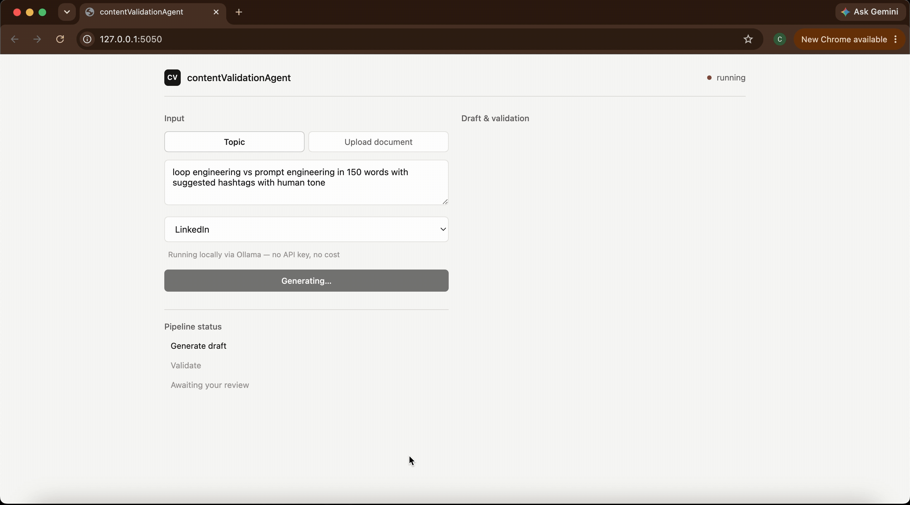
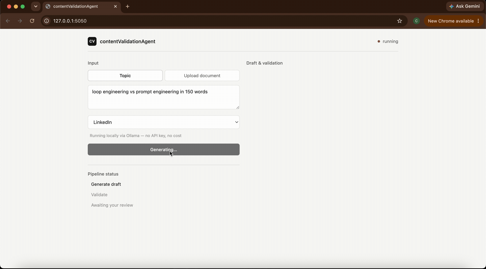

# contentValidationAgent

A LangGraph multi-agent pipeline that generates **and validates** LinkedIn/Medium posts — from a topic string or an uploaded document (.docx/.txt/.md) — using a locally-run LLM via Ollama for generation and a fine-tuned small language model (Llama 3.2 3B + LoRA) for voice/tone validation in a bounded generate → validate → revise loop with human-in-the-loop escalation.

Fully local, zero API keys, zero per-call cost — everything runs on your own machine.

The SLM validator reuses the same base model and PEFT/Unsloth fine-tuning
pattern as [`slm-toolcall-lora`](../slm-toolcall-lora) — applied here to a
classification/scoring task instead of tool-call generation.

## Why two models instead of one

Long-form generation genuinely benefits from a capable model's coherence.
But *validating whether a draft sounds like a specific person* is a narrow, repeatable classification task — a good fit for a small model fine-tuned on that person's own writing, save tokens & API cost on every iteration of a revise loop without adding to a single generation call's latency.

## Demo

**Clean pass — high voice match, low AI-sounding score (voice 1.00, AI-sounding 0.00)**



**Borderline draft flagged for review (voice 0.63, AI-sounding 0.25)**



## Architecture

```
router → generate_from_topic ─────────┐
      └→ extract_doc → rewrite_from_doc┤
                                        ▼
                                    validate ◄──┐
                                  /    |    \   │
                          revise ┘  finalize  human_review
                                        │            │
                                       END          END
```

`validate` runs:
- **voice_score / ai_sounding_score** — fine-tuned SLM classifier (falls back to a rule-based heuristic if no adapter has been trained yet, so the pipeline runs standalone out of the box)
- **platform_fit** — word count / hashtag rules, deterministic
- **factual_flag** — flags unattributed numeric claims for mandatory human review (no model in this pipeline self-certifies facts)

The loop is bounded by `max_iterations` (default 3); if it's exhausted without passing, control routes to `human_review` rather than silently shipping a bad draft.

## Setup

```bash
pip install -r requirements.txt
sudo apt install pandoc   # required for .docx extraction

brew install ollama
ollama serve              # run as a background service
ollama pull llama3.2      # ~2GB
```

Set `OLLAMA_MODEL` env var to use a different pulled model (e.g. `mistral`).

Tradeoff to know going in: a local 3B-8B model is noticeably weaker at long-form,voice-consistent writing than hosted frontier models — expect the validate/revise loop to hit `max_iterations` more often.

## Web UI

A minimal Flask UI wraps the same graph — no pipeline logic lives in the web layer, it's a thin JSON API plus a single-page vanilla-JS frontend.

```bash
ollama serve   # if not already running
python web/app.py
```

Open `http://localhost:5050`. Same topic/document input modes as the CLI.

The web graph (`graph/build_web_graph.py`) is identical to the CLI graph except the terminal `human_review` node doesn't block on `input()` — it surfaces the draft and issues in the browser instead, where you approve, edit, or note the flagged issues yourself. The CLI (`main.py`) is completely unaffected by this — it still uses `graph/build_graph.py`.

## Run

```bash
# From a topic
python main.py --topic "loop engineering vs prompt engineering" --platform linkedin

# From an uploaded document
python main.py --doc ./my_notes.docx --platform medium
```

## Training the real voice classifier

The SLM validator ships with a heuristic fallback so the repo is runnable
immediately. To get the real signal:

1. Build `data/voice_training_examples.jsonl`:
   - **Positive examples** (`voice_score: ~0.9+`): your own published posts
   - **Negative examples** (`ai_sounding_score: ~0.9+`): early LLM drafts
     you personally rejected as sounding too generic — worth saving these
     going forward as they accumulate for free during normal use
2. `python slm/train_voice_lora.py` (same Colab T4 / Unsloth constraints
   as `slm-toolcall-lora`)
3. Set `VOICE_LORA_ADAPTER_PATH` to point at the saved adapter — no code
   changes needed elsewhere, `voice_classifier.py` picks it up automatically.

## Testing

```bash
python tests/test_graph_smoke.py   # CLI graph, both entry paths
python tests/test_web_smoke.py     # Flask API, both entry paths + error cases
```

Both mock the LLM calls so the full graph (entry paths, validate/revise
loop, human review) can be verified without API keys or GPU access.

## Project structure

```
graph/
  state.py          # shared TypedDict state schema
  build_graph.py     # LangGraph wiring (CLI)
  build_web_graph.py # same wiring, non-blocking human review (web)
nodes/
  router.py          # topic vs document branch decision
  extract_doc.py      # pandoc-based .docx/.txt extraction
  generate.py         # topic → first draft
  rewrite_from_doc.py # document → first draft
  validate.py         # aggregates all validation checks
  revise.py           # targeted rewrite based on flagged issues
  finalize.py         # human_review (CLI, blocking) + finalize
  human_review_web.py # human_review (web, non-blocking)
  llm_client.py       # Ollama-only generation call, local and free
slm/
  voice_classifier.py  # SLM scoring + heuristic fallback
  train_voice_lora.py  # LoRA fine-tuning script
web/
  app.py              # Flask routes: GET / , POST /api/generate
  templates/index.html
  static/css/style.css
  static/js/app.js     # vanilla ES6, single controller class
data/
  voice_training_examples.jsonl  # training data (fill in your own)
tests/
  test_graph_smoke.py  # CLI graph
  test_web_smoke.py    # Flask API
```

## Known limitations

- Generation runs on a local 3B-8B model via Ollama — noticeably weaker
  at long-form, voice-consistent writing than hosted frontier models.
  Expect more validate/revise iterations and occasional drafts that need
  manual editing in human_review. This is a deliberate cost/quality
  tradeoff for a zero-API-cost portfolio project, not an oversight.
- The heuristic fallback for voice scoring (sentence-length variance) is a
  placeholder, not a real signal — it exists only so the graph is runnable
  before training data is collected. Don't cite its scores as meaningful.
- `factual_flag` detection is a simple regex for unattributed numbers, not
  actual fact-checking — it's a routing signal to force human review, not
  a verification step.
- No persistence layer yet — each run is stateless. Adding LangGraph
  checkpointing (SQLite or Postgres) would let human_review pause/resume
  across a real web session instead of blocking on `input()`.
